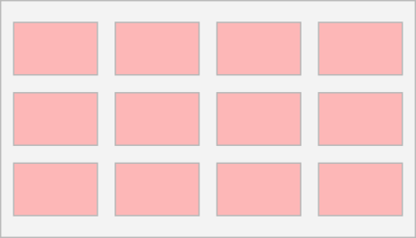
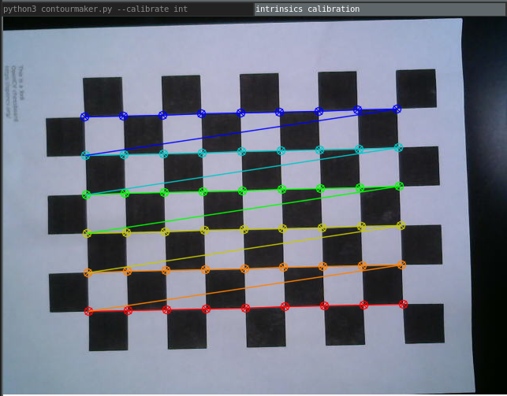
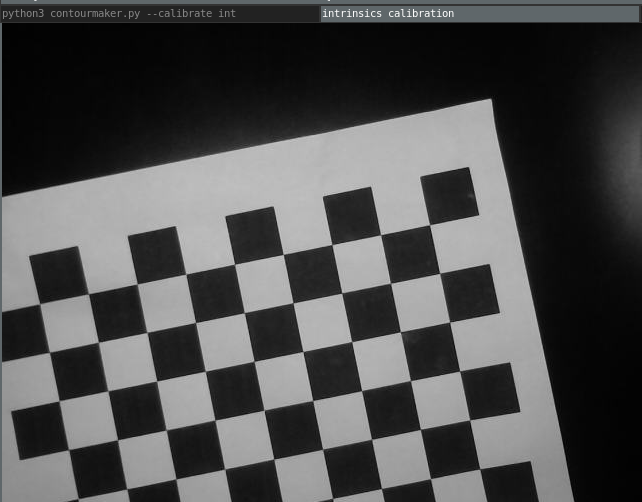
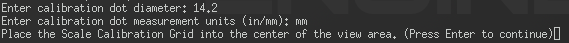
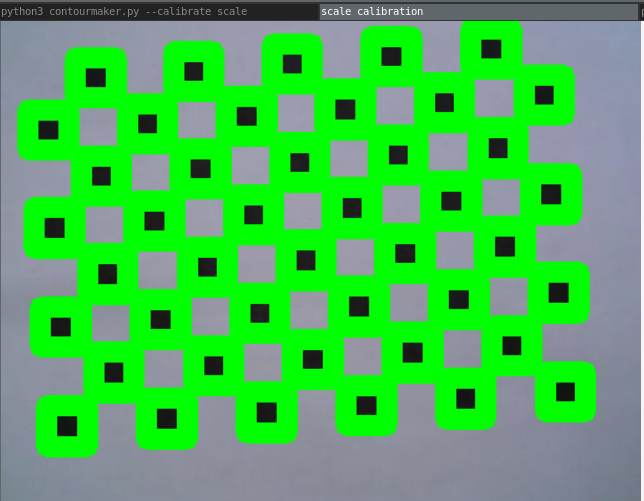

# Contour Maker
Contour Maker is an application to generate contour files using a Better Process Imaging Stand.

## **Running the Application**
### **Calibration**
Prior to running the Contour Maker application for the first time, or after adjusting the camera, it is necessary to calibrate the imaging stand. 

To calibrate everything, run:

`./contourmaker --calibrate all`

This will run the calibration routines for both the camera intrinsics as well as dimensional scaling.

Once calibration is complete, the calibration data will be written to file for future use.

The following sections describe how to perform the calibration, as well as how to run each calibration routine individually.

#### **Camera Intrinsics**
To calibrate camera intrinsics (image distortion correction) independently, run:

`./contourmaker --calibrate int`

During the Camera Intrinsics calibration, use the checkerboard calibration pattern located in:

`doc/calibration/intrinsics.png`

This pattern is taken from https://github.com/opencv/opencv/blob/master/doc/pattern.png

The calibration routine will capture 12 images. It's recommended to place the checkerboard on the imaging surface in the following pattern:

It's not necessary to be exact, but it is important to cover as much area as possible - especially around the edges (do not take images only in the center).

If the application has successfully detected the checkerboard calibration pattern, you should see the inner corners of the checkerboard highlighted like so:

If the checkerboard calibration pattern is not identified, you should see an image with the highlighting absent:

After each image, you can press any key to either:
- Retry an image if a checkerboard has been missed (after moving the pattern slightly)
- Capture the next calibration image (after moving the pattern to the next location)

After all 12 images have been captured, pressing enter will exit the intrinsics calibration routine.

#### **Dimensional Scaling**
To calibrate dimensional scaling independently, run:

`./contourmaker --calibrate scale`

A calibration dot file has been provided in:

`doc/calibration/scale.png`

This pattern is taken from https://github.com/opencv/opencv/blob/master/doc/acircles_pattern.png

It is important to measure the size of the dots as printer scaling may have an impact on the real-world dot size.

During the dimensional scaling calibration, you will be prompted to enter the size of the calibration dots you previously measured. Enter the numerical value, and then when prompted enter the units used during measurement (in/mm).

You will be prompted to place the calibration dot pattern directly under the camera, and press enter. If the calibration program has successfully captured the dots you should see the following:

You may now press enter to dismiss the image and complete scale calibration.

### **Capturing a Contour File**
To capture a contour file, place the desired objects into the imaging stand and run the following:

`./contourmaker`

This will generate an output SVG file in the application directory which may be imported into a CAM application.

---

## Supported File Formats
Currently Contour Maker only supports export in `.svg` format.

